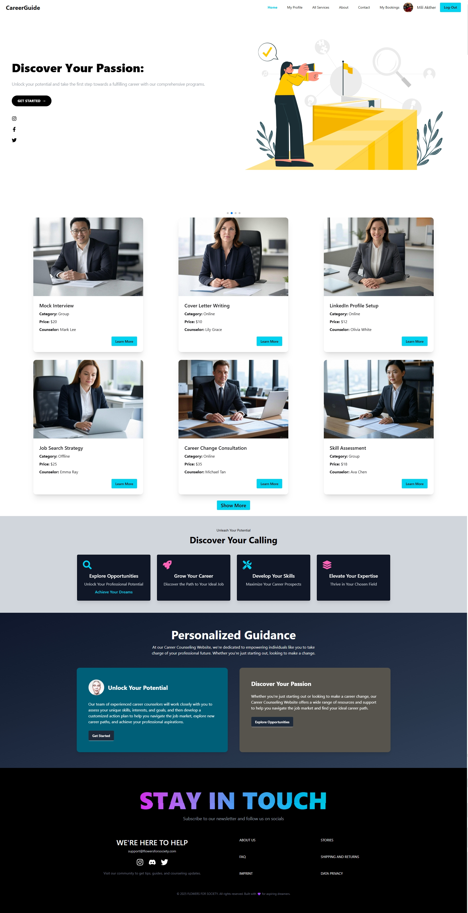

# 🌐 CareerGuide

**CareerGuide** is a user-friendly and modern web platform designed to help users navigate their career journey with helpful resources, account features, and interactive services. Built with React, Firebase Authentication, and Tailwind CSS, it offers seamless login, registration, and password recovery experiences.

🔗 **Live Site**: [https://career-guide-website.web.app](https://career-guide-website.web.app)

---

## ✨ Features

- 🔐 **Secure Authentication**  
  Firebase-powered email/password login, Google sign-in, and password reset functionality.

- 🧭 **Clean & Responsive UI**  
  Designed with Tailwind CSS and DaisyUI to ensure an elegant and accessible experience across all devices.

- 📝 **User Account Management**  
  New users can easily register, and returning users can securely log in and recover their passwords.

- 💬 **Notification System**  
  Integrated with `react-toastify` for real-time feedback on user actions (login success, password reset, errors, etc.).

- 🔄 **Routing with React Router**  
  Smooth and dynamic navigation experience with private route handling and state-based redirection.

---

## 🖼️ Screenshot

> 📸 Add a screenshot here after deployment  
> Example:
> 

---

## 🔧 Tech Stack

- **React.js** – Frontend library for building UI components  
- **React Router** – Client-side routing  
- **Firebase Auth** – User authentication (email/password & Google)  
- **Tailwind CSS** – Utility-first CSS framework  
- **DaisyUI** – Component library for Tailwind  
- **React Toastify** – Notifications and alerts  

---

## 📂 Setup Instructions

```bash
git clone https://github.com/yourusername/career-guide.git
cd career-guide
npm install
npm run dev
